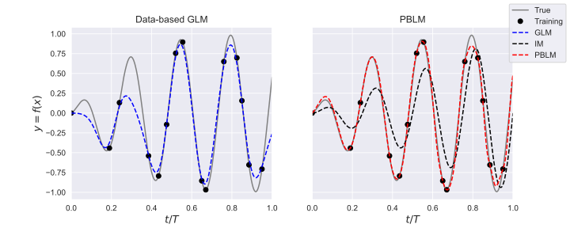

# Physics-Based Learning Methods From Scratch
Implementing and documenting PBLM.

## References
Weymouth, Gabriel D., and Dick KP Yue. "Physics-based learning models for ship hydrodynamics." Journal of Ship Research 57.01 (2013): 1-12.

Murphy, Kevin P. Machine learning: a probabilistic perspective. MIT press, 2012.
